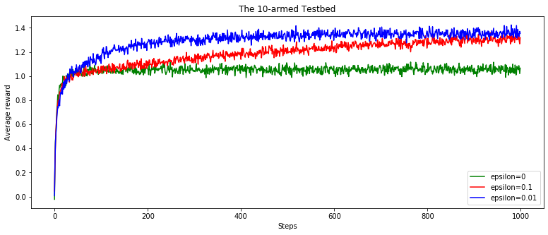

<!-- This is commented out. -->
# 🔬 reinforcement-learning

This repo will share content, notes and material to learn reinforcement leanring. 
My first goal is to try to implement all the examples/demonstration of the Richard S. Sutton and Andrew G. Barto. book "Reinforcement Learning: An Introduction"

## 📚 References:
[📺 Deepmind/UCL reinforcement learning courses on Youtube](https://www.youtube.com/playlist?list=PLqYmG7hTraZDNJre23vqCGIVpfZ_K2RZs)\
[📄 Deepmind/UCL reinforcement learning website](http://www0.cs.ucl.ac.uk/staff/D.Silver/web/Teaching.html)\
[📓 Reinforcement Learning: An Introduction - Richard S. Sutton and Andrew G. Barto.](RL%20DeepMind/RLbook2018.pdf)\

## Chapter 2: Multi-armed Bandits

[Notebook: The 10 armed testbed](2.3-the-10-armed-testbed.ipynb)

