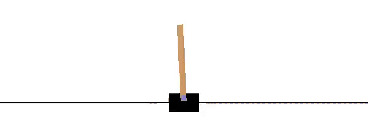

<!-- This is commented out. -->
# 🔬 reinforcement-learning

This repository will contain implementation of reinforcement learning algorithm. The end goal is to have a library of algorithm ready to use, as simple as possible, but not simpler. It is partly inspired by the repository [minimalRL](https://github.com/seungeunrho/minimalRL) but less extreme with the implementations.

## Deep Q-Learning

- [x] [Deep Q-Learning](deep-q-learning.py)
- [x] [Dueling Deep Q-Learning](dueling-deep-q-learning.py)
- [ ] Double Deep Q-Learning

## 📚 References:
[📺 Deepmind/UCL reinforcement learning courses on Youtube](https://www.youtube.com/playlist?list=PLqYmG7hTraZDNJre23vqCGIVpfZ_K2RZs)\
[📄 Deepmind/UCL reinforcement learning website](http://www0.cs.ucl.ac.uk/staff/D.Silver/web/Teaching.html)\
[📓 Reinforcement Learning: An Introduction - Richard S. Sutton and Andrew G. Barto](RL%20DeepMind/RLbook2018.pdf)
