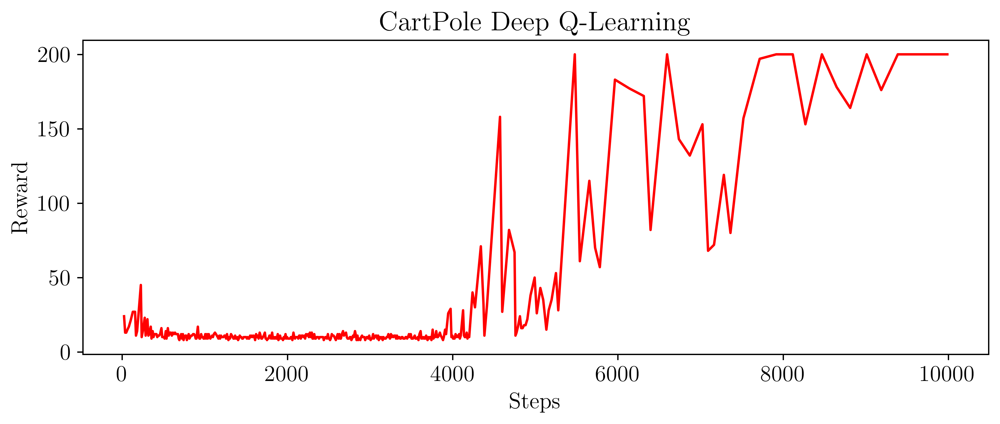

## Deep D-Learning

This [algorithm](https://www.cs.toronto.edu/~vmnih/docs/dqn.pdf) come from a modification of the Q-Learning technique adapted to be coupled with function approximation.
The core of the algorithm is taken from the famous [tutorial](https://pytorch.org/tutorials/intermediate/reinforcement_q_learning.html)
from pytorch. The comments linked to the code of the tutorial provide a very detailed explanation. However the code is not 
so minimalistic and if the original code is ran, it will not converge because of the hyperparameters choice.

This implementation is more minimalistic, the hyperparameter are well tuned. The environment should be solved in ~500 episodes (~40 000 steps)

## Algorithm

Here is the algorithm taken from the [original paper](https://www.cs.toronto.edu/~vmnih/docs/dqn.pdf)


## Code breakdown

### Memory

This part of the algorithm will contain all the last transition that the agent has been through. The transistion are stored into a `namedtuple` container which will contain the state, the cation, the reward, the next state as well as the 'done' indicator.

```
Experience = namedtuple('Experience', ['state', 'action', 'reward', 'next_state', 'done'])

class Memory:
    def __init__(self, capacity):
        self.capacity = capacity
        self.buffer = deque(maxlen=capacity)

    def push(self, experience):
        self.buffer.append(experience)

    def sample(self, batch_size):
        experiences = random.sample(self.buffer, batch_size)
        return Experience(*zip(*experiences))

    def __len__(self):
        return len(self.buffer)
```
The memory is composed of a deque of size capacity, when a sample is pushed but the memory is full, it will discard the oldest sample and append the new sample to 
the queue.  
When the `sample` method is called, a batch of experience are sampled from the queue.   
In this implementation, instead of returning a list of experience, I prefer to return a single experience object that contains list of state, list of action, etc. The command `Experience(*zip(*experiences))` enable this.

### Deep Q-Network
```
class DeepQNetwork(nn.Module):
    def __init__(self, input_features, output_features, hidden_units=None):
        super().__init__()

        hidden_units = hidden_units or [128, 128]
        units = [input_features] + hidden_units + [output_features]
        self.layers = nn.ModuleList()
        for i, o in pairwise(units):
            self.layers.append(nn.Linear(i, o))

    def forward(self, x):
        for layer in self.layers[:-1]:
            x = F.relu(layer(x))
        return self.layers[-1](x)
```
The `DeepQNetwork` is a function approximation implemented using pytorch, it takes the state as input and output the predicted Q-Values of this state.  
The layers are created using a for loop and a list of the successives units needed.  
The `pairwise` tool from [`more_itertools`](https://docs.python.org/3/library/itertools.html#itertools-recipes) allows to conviniently create pairs of input-output features for the linear layers
For the implementation of the `forward` method, a ReLU function is applied to all the layers except the last layer, since the Q-Values can be positive or negative.

### Policy

```
class EpsilonGreedyPolicy:
    def __init__(self, local_network, action_space, epsilon_start, epsilon_final, epsilon_decay):
        self.step = 0
        self.local_network = local_network
        self.actions = range(action_space)
        self.epsilon_start, self.epsilon_final, self.epsilon_decay = epsilon_start, epsilon_final, epsilon_decay

    def choose_action(self, observation, epsilon=None):
        epsilon = epsilon or self.get_epsilon()
        self.step += 1
        if random.random() > epsilon:
            with torch.no_grad():
                q_values = self.local_network(torch.tensor(observation, dtype=torch.float32).unsqueeze(0))
                return q_values.max(1)[1].item()
        else:
            return random.choice(self.actions)

    def get_epsilon(self):
        return self.epsilon_final + (self.epsilon_start - self.epsilon_final) * np.exp(-1. * self.step / self.epsilon_decay)
```
This class is the implementation of the Policy of our Agent, the policy will choose which action the agent needs to perform. In our case we use the epsilon-greedy policy, it means that there is an 1-epislon chance that the agent will choose the action that the network believe is "optimal" and an epsilon chance to take a random action.  
We start the learning with a high epsilon, and will decrease the epsilon little by little, every time the policy choose an action. To decrease epsilon, we use the exponential decay as described in the paper.

### Agent
```
class DeepQLearning:
    def __init__(self, policy, target_network, optimizer, memory_capacity, batch_size):
        self.step = 0
        self.policy = policy
        self.optimizer = optimizer
        self.batch_size = batch_size
        self.target_network = target_network
        self.memory = Memory(memory_capacity)

    def train(self, total_steps):
        env = gym.make(ENVIRONMENT)
        self.update_target_network()
        recent_scores = deque(maxlen=100)
        recent_losses = deque(maxlen=100)

        for episode in count():
            state, score = env.reset(), 0

            for _ in count():
                action = self.policy.choose_action(state)
                next_state, reward, done, _ = env.step(action)

                if type(next_state) is not np.ndarray:
                    next_state = np.array(state)
                self.memory.push(Experience(state, action, reward, next_state, done))

                self.step += 1
                score += reward
                state = next_state

                if len(self.memory.buffer) > self.batch_size:
                    loss = self.learn()
                    recent_losses.append(loss)

                if self.step % NETWORK_UPDATE_FREQUENCY == 0:
                    self.update_target_network()

                if done:
                    break

            if self.step > total_steps:
                break

            recent_scores.append(score)
            print(f'Step:{self.step}\tEpisode:{episode}   Score:{np.mean(recent_scores):.2f}   Loss{np.mean(recent_losses or [0]):.5f}   Epsilon{self.policy.get_epsilon():.2f}')

    def learn(self):
        batch = self.memory.sample(self.batch_size)

        done = torch.FloatTensor(batch.done)
        action = torch.LongTensor(batch.action)
        reward = torch.FloatTensor(batch.reward)
        state = torch.FloatTensor(np.float32(batch.state))
        next_state = torch.FloatTensor(np.float32(batch.next_state))

        q_values = self.policy.local_network(state)
        next_q_values = self.target_network(next_state)

        q_value = q_values.gather(1, action.unsqueeze(1)).squeeze(1)
        next_q_value = next_q_values.max(1)[0]
        expected_q_value = reward + GAMMA * next_q_value * (1 - done)

        loss = (q_value - expected_q_value.detach()).pow(2).mean()

        self.optimizer.zero_grad()
        loss.backward()
        self.optimizer.step()
        return loss.item()

    def update_target_network(self):
        self.target_network.load_state_dict(self.policy.local_network.state_dict())
```
## Results 



Here is a plot of the results versus the step. The agent achieve to solve the environment after ~500 episodes.

## References

[Playing Atari with Deep Reinforcement Learning, Mnih et al., 2013](https://www.cs.toronto.edu/~vmnih/docs/dqn.pdf)
